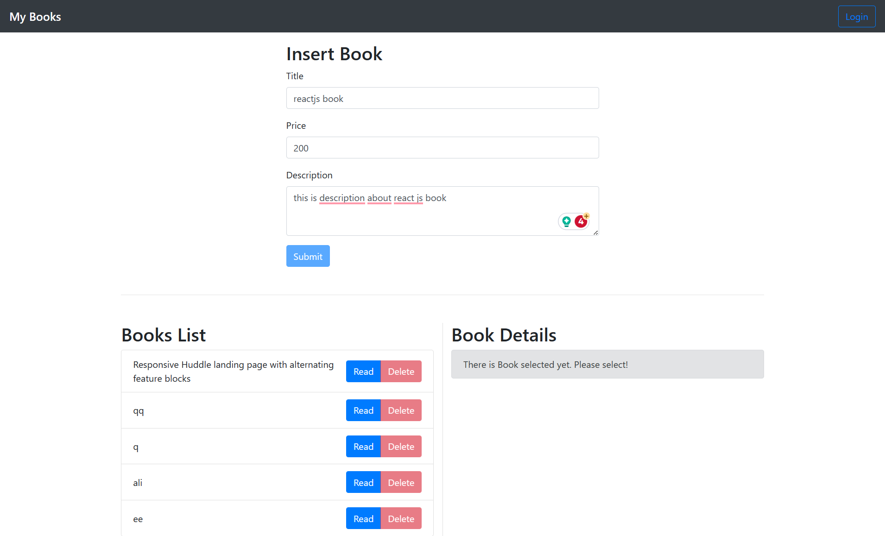

# Book Store using Redux&Toolkit

## Description
- login and logout
- can add info about book like (title ,price , description)
- show book list
- show book details
- delete specific book
- update specific book

## Insallations
 - after download repo run  `npm install` to download dependencies.
 - create folder for sever and run `npm init` & `npm i json-server`

## Design

